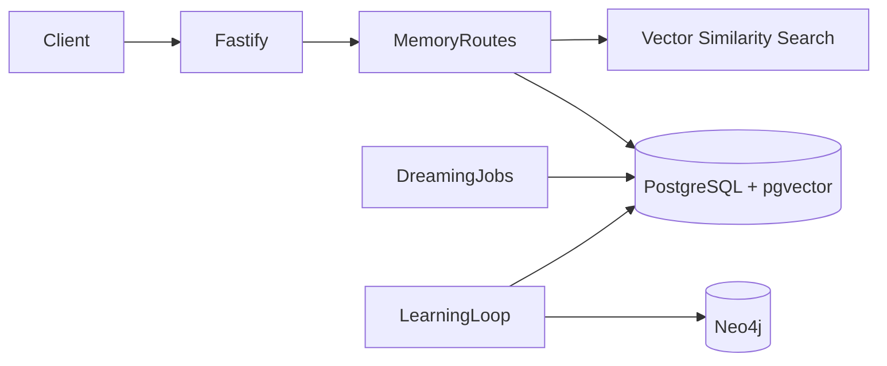
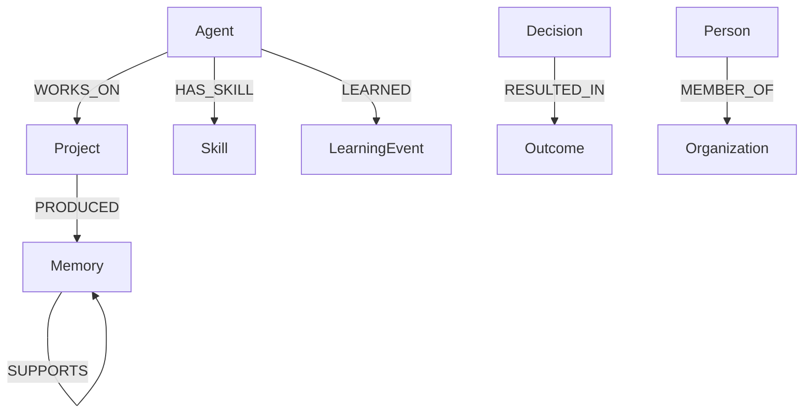
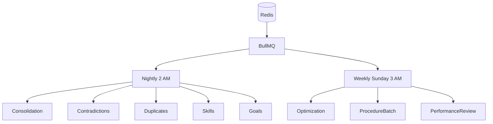
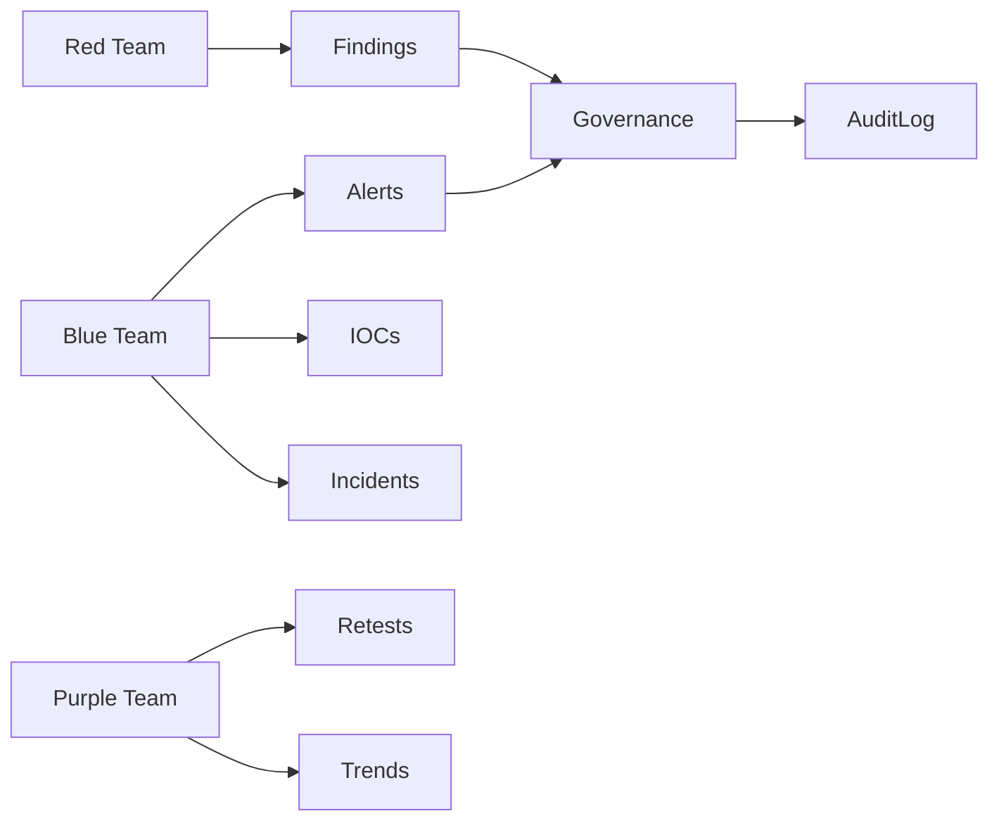

# Architecture

## Status Labels

- ✅ COMPLETEy: implemented and has targeted tests.
- ⚠️ PARTIAL: implemented, but missing full edge-case coverage, production hardening, or direct tests.
- 🔧 STUBBED: scaffold behavior only.
- 📋 PLANNED: not started.

## Memory Flow

## Knowledge Graph Schema

Supported labels are Person, Agent, Project, Decision, Organization, Skill, Outcome, Memory, and LearningEvent.

## Job Scheduler

## Security Workspace Hierarchy

## Module Status

| Module | Status | Notes |
| --- | --- | --- |
| `src/services/graph.ts` | ⚠️ PARTIAL | Neo4j integration and constraints implemented; direct route tests not included. |
| `src/routes/graph.ts` | ⚠️ PARTIAL | CRUD-style graph routes implemented; no auth beyond global token. |
| `src/services/procedural.ts` | ✅ COMPLETEy | Deterministic extraction and tests for 3-step workflow. |
| `src/routes/procedural.ts` | ⚠️ PARTIAL | Implemented; route persistence tests not included. |
| `src/services/learning.ts` | ⚠️ PARTIAL | OpenAI extraction implemented; mocked tests not yet added. |
| `src/routes/learning.ts` | ⚠️ PARTIAL | Implemented; route tests not included. |
| `src/jobs/dreaming.ts` | ⚠️ PARTIAL | Jobs and schedules implemented; no integration tests for Redis/BullMQ. |
| `src/routes/dreaming.ts` | ⚠️ PARTIAL | Status and manual trigger implemented. |
| `src/services/selfimprovement.ts` | ⚠️ PARTIAL | Uses `failure_log` as outcome history because no dedicated table exists. |
| `src/routes/selfimprovement.ts` | ⚠️ PARTIAL | Implemented; route tests not included. |
| `src/services/resources.ts` | ⚠️ PARTIAL | Implemented and test written; test could not pass here because PostgreSQL was unreachable. |
| `src/routes/resources.ts` | ⚠️ PARTIAL | Implemented and test written; test could not pass here because PostgreSQL was unreachable. |
| `src/routes/redteam.ts` | ⚠️ PARTIAL | Finding approval gate tested; OpenAI tests require mocks. |
| `src/routes/blueteam.ts` | ⚠️ PARTIAL | Implemented with new log/alert tables; no direct tests. |
| `src/routes/purpleteam.ts` | ⚠️ PARTIAL | Implemented; Redis retest scheduling untested. |
| `src/routes/governance.ts` | ⚠️ PARTIAL | Implemented and test written; test could not pass here because PostgreSQL was unreachable. |
